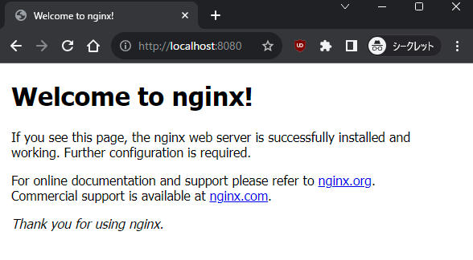

# 色々なコンテナイメージを使ってみよう
## 1.以下のコマンドを実行してみよう。

```bash
docker run --rm -p 8080:80 nginx:1.25
```

### コマンドの解説
- docker run --rm nginx:1.25
   - --rm
      - コンテナを終了したときにコンテナを削除するオプション
   - nginx:2.4
      - nginxというコンテナイメージの1.25というタグを指定してコンテナを起動する
      - nginxの1.25系の最新バージョンがインストールされたイメージを指定しているという意味
   - -p 8080:80
      - ホストの8080番ポートをコンテナの80番ポートにマッピングするオプション

### 期待結果
手順1は以下のようなメッセージが表示されれば成功。

```
kawasaki.taiga@HAYATE:~$ docker run --rm -p 8080:80 nginx:1.25
Unable to find image 'nginx:1.25' locally
1.25: Pulling from library/nginx
Digest: sha256:86e53c4c16a6a276b204b0fd3a8143d86547c967dc8258b3d47c3a21bb68d3c6
Status: Downloaded newer image for nginx:1.25
--中略--
```


## 2.ブラウザで http://localhost:8080 にアクセスしてみよう。
以下のような画面が表示されれば成功。  


