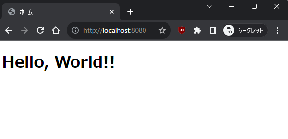

# 実際にコンテナイメージを作ってみよう
## 1. コンテナイメージのビルド
以下のコマンドを実行してみよう。

```bash
# リポジトリのsample-appディレクトリに移動
cd ../sample-app
# イメージをビルド
docker build -t sample-app .
```

### コマンドの解説
- docker build -t sample-app .
    - -t sample-app
        - ビルドするイメージの名前をsample-appとするオプション
    - .
        - dockerをビルドするときに現在のディレクトリを全部読み込むオプション

### 期待結果
以下のようなメッセージが表示されれば成功。

```
[+] Building 9.0s (11/11) FINISHED                    docker:default
 => [internal] load build definition from Dockerfile            0.1s
--中略--
 => => writing image sha256:12d2e1e28f7b0a28b7dd3a52f           0.0s 
 => => naming to docker.io/library/sample-app                   0.0s
```

## 2. コンテナイメージからコンテナを起動してみる
以下のコマンドを実行してみよう。

```bash
docker run --rm -p 8080:80 sample-app
```

## 期待結果
以下のようなメッセージが表示されれば成功。

```
 * Serving Flask app 'app'
 * Debug mode: on
WARNING: This is a development server. Do not use it in a production deployment. Use a production WSGI server instead.
 * Running on all addresses (0.0.0.0)
 * Running on http://127.0.0.1:80
 * Running on http://172.17.0.2:80
Press CTRL+C to quit
 * Restarting with stat
 * Debugger is active!
 * Debugger PIN: 811-283-419
```

## 3. アプリにブラウザからアクセスしてみよう
以下のような画面が表示されれば成功。  



