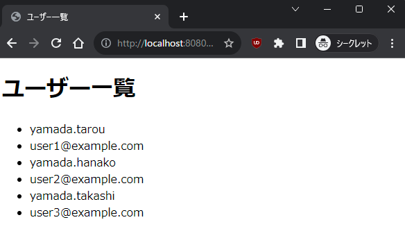

# docker composeでサービスを立ち上げてみよう
## 1. サービスの起動

```bash
# リポジトリのsample-appディレクトリに移動
cd ../sample-app
# サービスの起動
docker-compose up
```

### コマンドの解説
- docker-compose up
    - 現在のディレクトリ以下にあるdocker-compose.ymlを読み込んでサービスを起動するコマンド

### 期待結果
以下のようなメッセージが表示されれば成功。

```
[+] Building 0.0s (0/0)                 docker:default
[+] Running 4/3
 ✔ Network sample-app_default   Created           0.0s 
 ✔ Volume "sample-app_db_data"  Created           0.0s 
 ✔ Container sample-app-db-1    Created           0.1s 
 ✔ Container sample-app-app-1   Created           0.1s 
Attaching to sample-app-app-1, sample-app-db-1
sample-app-db-1   | 2023-11-20 05:51:50+00:00 [Note] [Entrypoint]: Entrypoint script for MySQL Server 8.2.0-1.el8 started.
--中略--
sample-app-db-1   | 2023-11-20T05:52:06.378844Z 0 [System] [MY-010931] [Server] /usr/sbin/mysqld: ready for connections. ~
sample-app-app-1  |  * Serving Flask app 'app'
--中略--
sample-app-app-1  |  * Running on http://127.0.0.1:80
```
## 3. アプリにブラウザからアクセスしてみよう
https://localhost:8080/users にアクセスしてみよう。
以下のような画面が表示されれば成功。  



